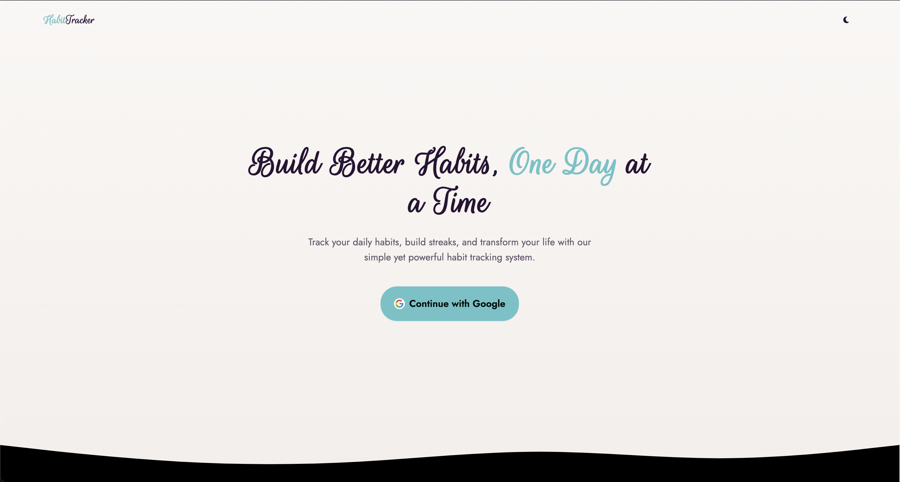
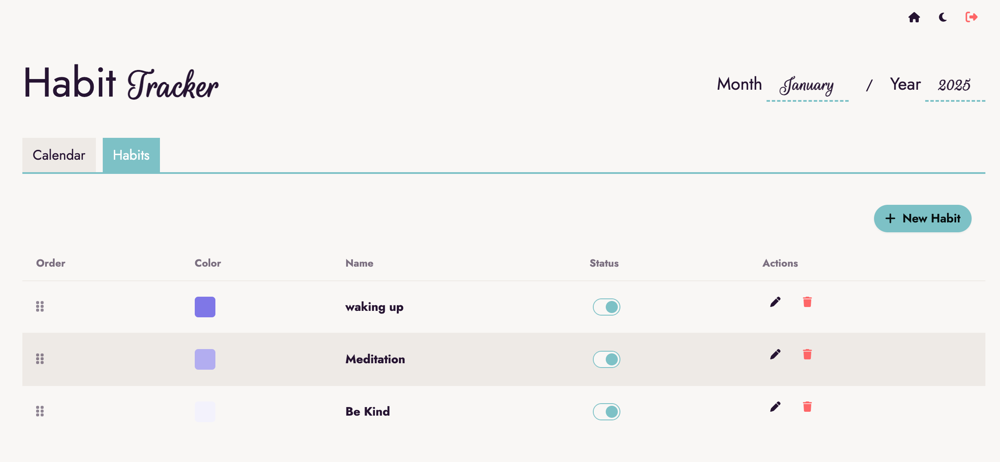

### Habit Tracker

A simple habit tracker built with Laravel and Livewire.

## Screenshots
<div style="display: grid; grid-template-columns: repeat(auto-fit, minmax(300px, 1fr)); gap: 20px;">
    
    
    
</div>

## Installation

1. Clone the repository:
   ```bash
   git clone https://github.com/yourusername/habit-tracker.git
   cd habit-tracker
   ```

2. Install PHP dependencies:
   ```bash
   composer install
   ```

3. Install Node dependencies:
   ```bash
   npm install
   ```

4. Set up environment:
   ```bash
   cp .env.example .env
   # Configure your database settings in .env
   ```

4a. Set up Google OAuth credentials:
   - Go to the [Google Cloud Console](https://console.cloud.google.com)
   - Create a new project or select existing one
   - Enable the Google+ API
   - Go to Credentials and create OAuth 2.0 Client ID
   - Add authorized redirect URI: `http://localhost:8000/auth/google/callback`
   - Copy Client ID and Client Secret
   - Add to your .env file:
     ```bash
     GOOGLE_CLIENT_ID=your_client_id_here
     GOOGLE_CLIENT_SECRET=your_client_secret_here
     GOOGLE_REDIRECT_URI=http://localhost:8000/auth/google/callback
     ```

5. Generate application key:
   ```bash
   php artisan key:generate
   ```

6. Run database migrations:
   ```bash
   php artisan migrate
   ```

7. Start development servers:
   ```bash
   # In first terminal:
   npm run dev

   # In second terminal:
   php artisan serve
   ```

Your application should now be running at http://localhost:8000

## Features

- [x] Create and manage habits
- [x] Track daily habit completions
- [x] User authentication and profiles
- [x] Responsive mobile design
- [x] Dark/Light theme toggle
- [ ] Organize habits into categories
- [ ] View habit streaks and progress statistics


## Google Analytics
To enable Google Analytics tracking:

1. Create a Google Analytics 4 property in your [Google Analytics account](https://analytics.google.com)

2. Get your Measurement ID (starts with G-)

3. Add these variables to your .env file:
   ```bash
   GOOGLE_ANALYTICS_ID=your_measurement_id
   GOOGLE_ANALYTICS_ENABLED=true
   ```

The tracking code will be automatically included in the base layout when enabled. You can verify it's working by checking your Google Analytics real-time reports.

Note: Analytics are only included in production environments when `GOOGLE_ANALYTICS_ENABLED` is set to true.
